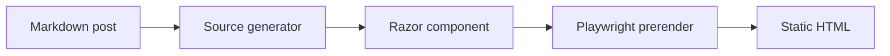

# Post Title

Start with the durable idea, surprising result, or concrete problem. Keep the opening paragraph useful when it appears alone in readers and previews.

## Claim

State the main claim in one or two paragraphs. Prefer evidence over framing: measurements, code paths, tradeoffs, or a failed approach that changed the conclusion.

## Evidence

Use normal markdown, focused headings, and short paragraphs.

```csharp
public sealed record BlogPost(
    string Title,
    string Route,
    DateTime Date);
```

Use Mermaid for architecture, flow, and dependency explanations:



Use images when they carry evidence or make a result inspectable:


Use links for source material, implementation references, and follow-up reading:

- [Repository source](https://github.com/mohdali/mohdali.github.io)
- [Related post](/posts/simple-blazor-blog)

## Reader Takeaway

End with the reusable lesson: what should the reader change, try, or avoid after reading?

## Publishing Notes

- Hypothesis:
- Primary audience:
- Primary metric:
- Distribution notes:
