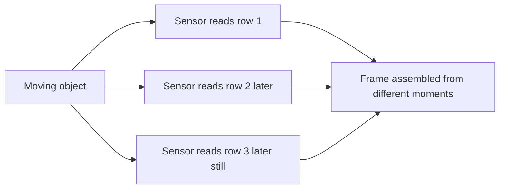
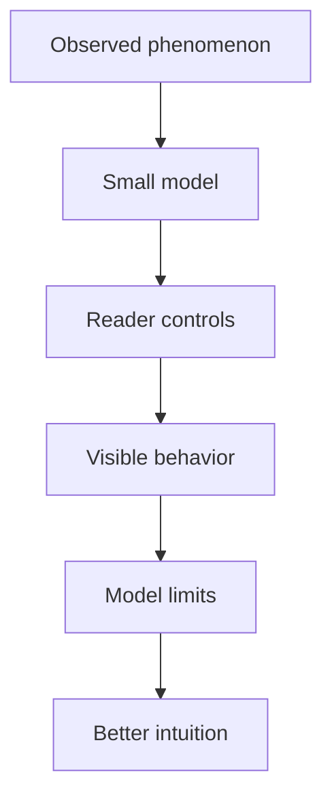

The oldest post on this site that still feels like the kind of thing I want to make is [Rolling Shutter Simulation](/posts/Rolling-Shutter-Simulation).

It is not the most polished page. It carries some old embedding decisions, and the post is mostly a wrapper around an Observable notebook. But the shape is right: explain a phenomenon with something visual, inspectable, and adjustable.

That is the direction I want more posts to take.

<figure>
  
  <figcaption>A real rolling-shutter artifact makes the blades look bent because rows are exposed at slightly different times. Image: <a href="https://commons.wikimedia.org/wiki/File:Propellor_with_rolling-shutter_artifact.jpg">Dicklyon</a>, <a href="https://creativecommons.org/licenses/by-sa/4.0">CC BY-SA 4.0</a>, via Wikimedia Commons.</figcaption>
</figure>

## Why The Visual Version Works

Rolling shutter is easy to describe badly. A camera sensor does not capture the whole frame at once; it scans across rows over time. If the subject moves while the scan is happening, different rows record different moments.

That explanation is true, but it is still a little slippery. A small simulation makes the idea easier to believe.

The useful part is not animation for its own sake. The useful part is that the reader can connect the rule to the artifact. If the simulated scan speed changes, the distortion changes. If the rotation speed changes, the shape changes. The post becomes an explanation you can poke.

## A Better Pattern For Future Posts

The old rolling-shutter page suggests a repeatable pattern:

1. Start with the real phenomenon.
2. State the smallest model that explains it.
3. Give the reader one or two controls.
4. Show where the model breaks.
5. Link the model back to the real artifact.

That is a stronger format than a long prose-only explanation for topics with motion, geometry, timing, probability, or data.

For this site, that means regular markdown should stay easy, but the platform should keep supporting richer artifacts: Observable notebooks, D3 diagrams, Blazor components, and small simulations.

## What I Would Change Now

If I rebuilt the rolling-shutter post today, I would keep the interactive core and change the surrounding publishing shape.

The post should have:

1. A stronger written setup before the embed.
2. A diagram explaining the scan process.
3. A small list of expected observations before the controls.
4. A stable social preview and description.
5. A follow-up note about what the simplified model leaves out.

The lesson is not that every post needs a simulation. The lesson is that some topics become much clearer when the artifact is part of the argument.

That is the experiment I want to run with future posts: use visuals when they make an idea easier to inspect, not when they merely decorate the page.
