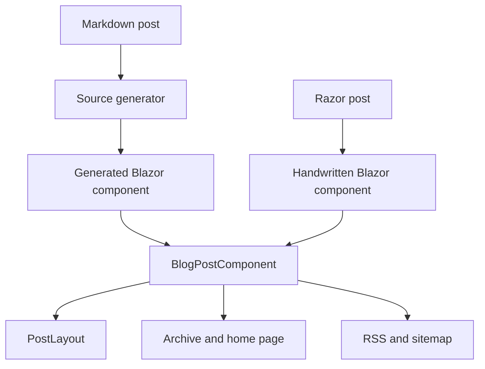
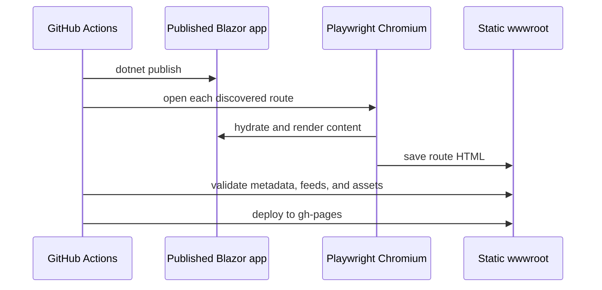

The current version of this site is still a Blazor WebAssembly app, but the publishing path now behaves more like a static site generator.

The important design choice is that authoring and runtime are separate concerns. Posts are written as markdown when they are mostly prose, but the build turns them into normal routed Blazor components. The browser does not parse markdown, discover files, or assemble post metadata at runtime.

That keeps the authoring loop small without giving up the component model that made the original Blazor version useful.

## The Shape Of The Pipeline

At a high level, the pipeline has four stages:


The markdown path and the Razor path meet at the same abstraction: a routed `BlogPostComponent`. That matters because the rest of the application does not need to know how a post was authored.



Razor posts still make sense for interactive essays. Markdown is the default for regular writing.

## Why Generate Components

The older version of the site used handwritten `.razor` files for every post. That gave each post full access to Blazor, but it made ordinary writing feel like programming.

Markdown fixes the writing experience, but parsing markdown in the browser would move complexity into the runtime. It would also make the first page load do work that is already knowable at build time.

The source generator is the compromise:

1. Markdig parses the markdown during compilation.
2. YAML frontmatter becomes typed post metadata.
3. Code fences become reusable Blazor components.
4. Mermaid fences become diagram components.
5. The generated output is a normal routed component.

That means the rest of the app still sees a simple component model.

```csharp
[Route("/posts/static-blazor-blog-pipeline")]
[Layout(typeof(PostLayout))]
public partial class Post_2026_05_03_StaticBlazorBlogPipeline : BlogPostComponent
{
    public string Title { get; set; } = "The Static Blazor Blog Pipeline";
    public DateTime Timestamp { get; set; } = new DateTime(2026, 5, 3);

    protected override void BuildRenderTree(RenderTreeBuilder builder)
    {
        // Generated from markdown at build time.
    }
}
```

The generated code is not something I want to maintain by hand. It is just the bridge between a good authoring format and the existing Blazor runtime model.

## Prerendering Is The Publication Boundary

After publish, a Playwright script opens each route and saves the rendered HTML. That step is the publication boundary: if a route renders a not-found page, if a Mermaid diagram fails to complete, or if required metadata is missing, the deployment should fail before GitHub Pages receives the output.



This is deliberately boring. The output should be plain static files: `index.html`, route-specific `index.html` files, assets, RSS, sitemap, and a `404.html` fallback for GitHub Pages.

## What Gets Checked

The checks I care about are publishing failures, not abstract purity:

1. Does every route in the sitemap have an HTML file?
2. Does every page have a useful title and description?
3. Do Open Graph and X/Twitter preview tags exist?
4. Do referenced social images exist?
5. Did a draft or smoke-test post leak into RSS or sitemap?
6. Did Mermaid render before the page was snapshotted?

Those are the things that turn into broken links, bad previews, or embarrassing deploys.

## The Tradeoff

The cost of this approach is build complexity. There is a source generator, a prerender script, and a validation step. That is more machinery than a plain markdown static-site generator.

The benefit is that the site keeps a Blazor component escape hatch. If a post needs a custom simulation, an embedded notebook, or a component that would be awkward in markdown, it can still be a Razor post.

That is the reason the architecture is worth keeping: most posts should be boring markdown, but the platform should not prevent richer technical explanations.
