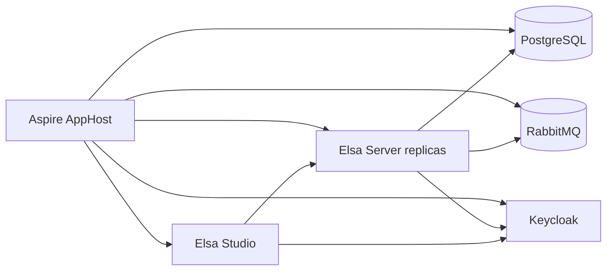

# Running Elsa Workflows Through Aspire

The interesting thing about running Elsa through Aspire is not that Aspire can start a few containers.

The interesting thing is that a workflow runtime stops looking like a sidecar and starts looking like part of a complete distributed application.

Elsa Workflows gives a .NET application workflow definitions, runtime execution, persistence, scheduling, HTTP activities, distributed runtime support, and Elsa Studio. Aspire gives a distributed application a code-first model for projects, containers, databases, queues, service discovery, health checks, telemetry, local orchestration, and deployment publishing.

Those are complementary jobs.

Elsa defines and runs long-lived business behavior. Aspire defines and runs the system that behavior lives inside.

## The Claim

Workflow systems become useful when they coordinate real services.

Distributed application platforms become useful when they have real behavior to run.

That is why this sample is a good pairing. Elsa gives Aspire a meaningful workload. Aspire gives Elsa the operational shape that a workflow platform eventually needs anyway: storage, messaging, authentication, replicas, health checks, logs, traces, and a path to deployment artifacts.

The sample is intentionally small, but it is not a single-process toy.

It runs:

- Elsa Studio
- Elsa Server with two replicas
- PostgreSQL for Elsa management and runtime persistence
- RabbitMQ for distributed runtime and cache messaging
- Keycloak for OpenID Connect login
- Aspire service defaults for health, discovery, logging, and telemetry
- a Kubernetes publishing environment

The point is not the "hello world" workflow. The point is the topology around it.

## The AppHost Is The Center

The AppHost is the most important file in the sample because it makes the application graph visible.

```csharp
var builder = DistributedApplication.CreateBuilder(args);

builder.AddKubernetesEnvironment("k8s");

var postgres = builder.AddPostgres("postgres")
    .WithDataVolume(isReadOnly: false)
    .WithLifetime(ContainerLifetime.Persistent);

var postgresdb = postgres.AddDatabase("elsadb");

var messaging = builder.AddRabbitMQ("messaging")
    .WithLifetime(ContainerLifetime.Persistent);

var keycloak = builder.AddKeycloak("keycloak", port: 18080)
    .WithoutHttpsCertificate()
    .WithDataVolume()
    .WithRealmImport("./Realms")
    .WithLifetime(ContainerLifetime.Persistent);
```

Then it wires the Elsa resources into that graph:

```csharp
var server = builder.AddProject<Projects.Elsa_Aspire_Server>("elsaserver")
    .WithReplicas(2)
    .WithHttpHealthCheck("/health")
    .WithReference(postgresdb)
    .WithReference(messaging)
    .WithReference(keycloak)
    .WaitFor(postgresdb)
    .WaitFor(messaging)
    .WaitFor(keycloak);

builder.AddProject<Projects.Elsa_Aspire_Studio>("elsastudio")
    .WithReference(server)
    .WithReference(keycloak)
    .WaitFor(server);
```

That is the first benefit: the architecture is in code.

Without Aspire, this kind of demo usually turns into instructions:

1. start Postgres
2. start RabbitMQ
3. start Keycloak
4. import a realm
5. configure ports
6. run two backend instances
7. point Studio at the backend
8. remember the startup order

Aspire replaces that with a model. The model says what exists, what depends on what, which resources need persistent state, which endpoints are referenced by other resources, and which environment can publish the system.

## What Elsa Brings

Elsa is the workflow layer.

In this sample, Elsa Server configures management and runtime persistence through PostgreSQL. It uses Quartz for scheduling. It uses MassTransit over RabbitMQ for distributed runtime behavior and distributed cache messaging. It enables HTTP activities, JavaScript expressions, workflow API endpoints, and real-time workflow updates for Studio.

The sample workflow is deliberately modest:

```csharp
public class TimerHelloWorldWorkflow : WorkflowBase
{
    protected override void Build(IWorkflowBuilder builder)
    {
        builder.Name = "Timer Hello World";
        builder.Root = new Sequence
        {
            Activities =
            {
                new Elsa.Scheduling.Activities.Timer(TimeSpan.FromSeconds(15))
                {
                    CanStartWorkflow = true
                },
                new WriteLine("Hello World from the Elsa timer workflow.")
            }
        };
    }
}
```

Every 15 seconds, the timer starts a workflow and writes:

```text
Hello World from the Elsa timer workflow.
```

That workflow is not the product story. It is a proof that the runtime is alive inside the distributed shape: two server replicas, shared persistence, messaging, scheduling, authentication, and a Studio frontend calling the backend through the configured topology.

## What Aspire Brings

Aspire turns the supporting environment into something inspectable.

Running the AppHost gives a dashboard with resources, endpoints, logs, health checks, and telemetry. For a workflow platform, that matters. A real workflow rarely stays inside one process. It might call an API, publish a message, write to a database, wait for a timer, and resume later after a human action.

When the behavior crosses service boundaries, the system surface matters as much as the workflow designer.

Elsa Studio shows workflow definitions and instances.

Aspire Dashboard shows the resources those workflows depend on.

That split is useful:



The workflow designer is not being asked to explain the whole distributed system. The AppHost and dashboard carry that concern.

## Authentication Belongs In The Topology

The sample uses Keycloak as the OpenID Connect provider.

That detail is important because authentication is often treated as documentation around a sample instead of part of the sample itself. Here, Keycloak is a resource in the application model. Aspire starts it, keeps its data in a volume, imports the `Elsa` realm, and exposes its endpoint to the services that need it.

Studio signs users in through Keycloak. Elsa Server validates bearer tokens issued by the same realm. The local `ElsaServer` client issues access tokens with the expected audience.

There is one practical local-development choice that is worth copying: the Keycloak port is pinned to `18080`.

OpenID Connect tokens contain an issuer. If the local Keycloak endpoint moves between runs, old browser cookies can contain tokens whose issuer no longer matches the server validation settings. Pinning the port removes that churn.

For demo authorization, the server uses an `IClaimsTransformation` to add broad Elsa permissions to authenticated users:

```csharp
if (principal.Identity?.IsAuthenticated == true)
{
    claimsIdentity.AddClaim(new Claim("permissions", "*"));
    principal.AddIdentity(claimsIdentity);
}
```

That is intentionally permissive. It keeps the sample focused on topology and OIDC plumbing rather than turning the article into a role-management tutorial.

## Distributed Elsa, Locally

The server runs with two replicas.

That one line changes the quality of the demo:

```csharp
.WithReplicas(2)
```

It forces the sample to behave more like a distributed runtime. The replicas share PostgreSQL persistence, coordinate through RabbitMQ-backed runtime and cache messaging, and expose health checks to Aspire.

That makes local development more honest.

If workflow execution depends on in-memory assumptions, replica mode is more likely to expose it. If storage or messaging is misconfigured, the failure shape is closer to the production shape. If the backend is unavailable, Studio talks to a real backend and fails through the same path a real deployment would use.

Aspire makes that topology easy to run.

Elsa makes the topology worth running.

## Deployment Starts From The Same Model

The sample also includes a Kubernetes compute environment:

```csharp
builder.AddKubernetesEnvironment("k8s");
```

That means the same AppHost used for local development can publish deployment artifacts:

```bash
aspire publish -o k8s-artifacts
```

For Kubernetes, Aspire generates Helm chart artifacts. The sample does not pretend that publishing is the same as a production rollout. You still need to deploy the generated chart with Helm, kubectl, or a GitOps workflow, and production settings need real review.

But the important boundary has moved. The topology is not re-described from scratch for deployment. It starts from the same application model.

## Version Notes

The sample currently builds on:

- .NET SDK `10.0.107`
- Aspire `13.2.4`
- Elsa `3.6.1`
- Elsa Studio `3.6.1`
- Aspire Keycloak and Kubernetes hosting integrations `13.2.4-preview.1.26224.4`

I checked the dedicated Elsa Studio OpenID Connect package status before publishing this post. The `Elsa.Studio.Authentication.OpenIdConnect` packages exist, but the available package version is `3.7.0-rc1` as of 2026-05-07. This repository stays on the stable Elsa Studio `3.6.1` line and uses a small local Keycloak module around Elsa Studio Login's OpenID Connect hooks.

That workaround should be revisited when the upstream OpenID Connect packages have a stable release aligned with the rest of the Elsa Studio stack.

## What This Sample Does Not Prove

The sample proves the baseline topology. It does not prove production readiness.

Several parts are intentionally loose:

- the workflow is only a timer-based hello world
- CORS is broad for demo purposes
- permissions are granted broadly after authentication
- the Keycloak module is local glue while upstream OIDC support matures
- Kubernetes publishing produces artifacts, not a full production deployment process

That is fine for this stage. A sample should be honest about what it demonstrates.

What it demonstrates is that Elsa can be treated as part of a distributed application from the first commit.

## The Next Layer

The next useful addition is an end-to-end business workflow that crosses service boundaries.

For example:

1. an `OrderApi` receives an order and starts an Elsa workflow
2. a small risk service scores the order
3. the workflow waits for approval when risk is high
4. a fulfillment step reserves inventory
5. a notification step sends a mock email or webhook
6. a compensation branch handles failure

That would show the full value of the pairing.

Elsa would orchestrate the business process. Aspire would run the topology. Studio would show the workflow definition and instances. Aspire Dashboard would show resources, health, logs, and traces. Publishing would still begin from the same AppHost.

That is the story worth building toward:

```text
Define the workflow in Elsa.
Define the distributed system in Aspire.
Run, observe, and publish the whole thing from one application model.
```

## Closing Thought

The useful result is not simply:

```text
Elsa can run in Aspire.
```

The useful result is:

```text
Elsa can be modeled as part of a complete distributed application.
```

That distinction matters.

A workflow engine is rarely alone for long. It needs state, messaging, identity, observability, scaling, and deployment shape. Aspire gives those concerns a code-first home. Elsa gives that home a real workflow runtime to operate.

That is why the pairing works.

## Links

- [Elsa.Aspire sample repository](https://github.com/mohdali/Elsa.Aspire)
- [Aspire overview](https://aspire.dev/get-started/what-is-aspire/)
- [Aspire deployment overview](https://aspire.dev/deployment/overview/)
- [Elsa Workflows documentation](https://docs.elsaworkflows.io/)
- [Elsa Studio OpenID Connect package](https://www.nuget.org/packages/Elsa.Studio.Authentication.OpenIdConnect)
