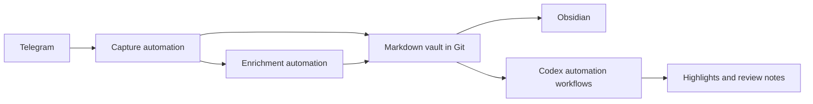

# My Personal Knowledge System Starts In Telegram, But Codex Keeps It Usable

I have been trying to make my personal knowledge system easier to use in normal day-to-day life.

The problem was not really where to store notes. I already like plain markdown, and I already like Obsidian as a reading and editing surface.

The problem was getting things into the system quickly enough, and then making sure they did not stay as a pile of unreviewed links.

For capture, the answer ended up being Telegram.

That does not mean Telegram is the knowledge base. It is just the lowest-friction front door I have. It is already on my phone, already in the share sheet, and fast enough to use when I only have a few seconds.

But Telegram only solved the first half of the problem.

The bigger change was adding Codex workflows around the vault. A one-off chat can help with a note, but a repeatable workflow can keep reviewing the same kind of mess every day without me redesigning the process each time.

<figure>
  
  <figcaption>The useful split is simple: capture quickly, keep the notes as files, and let Codex workflows make review less tedious.</figcaption>
</figure>

## The Shape Of The System

The current shape is roughly this:



Telegram is only the front door. The durable system is plain markdown in a private Git repository, opened through Obsidian on desktop and mobile.

I like this split because each tool has a small job.

Telegram is for fast capture.

Markdown and Git are for durable storage.

Obsidian is for reading and editing.

Codex is for repeatable review workflows.

The capture automation does not try to be smart at the wrong time. It records the note, preserves the source, keeps attachments when needed, and queues lightweight enrichment. The goal is to make the capture reliable and leave enough context for later.

Codex comes after that. It can inspect a batch of notes, clean up obvious mess, flag weak captures, and prepare review notes that are easier for me to read.

That is the part that made the system useful. Capture is easy to start, but review is where most note systems start to decay. Codex did not just give me another place to ask questions. It gave me a way to run the review loop as a workflow.

## Why Telegram Works As The Front Door

I used to think the important part of a knowledge system was the taxonomy.

Folder structure, tags, templates, backlinks, and dashboards all looked like the real design problem. They still matter, but they are not the first problem I wanted to solve.

The first problem is whether a note survives the moment when it occurs.

If capture requires choosing a folder, adding tags, filling in metadata, or opening a specific app, I will skip it too often. It may work at a desk. It does not work as well on a phone or between tasks.

Telegram gives the system a single front door. That reduces the number of decisions at capture time to one: send it.

The cost is that the inbox is messy. That is fine. I would rather clean a real inbox later than lose the note completely.

## Why Markdown And Git

The storage layer is deliberately simple.

The vault is plain markdown. The directory structure is visible. Git history exists. Attachments live beside notes. I can open the files with any editor, sync them with normal tools, and recover them without a proprietary export flow.

Git is not there because it is a perfect note backend. It is there because it gives me history, sync, reviewable changes, and a place Codex can operate on files directly.

The vault has a few main areas:

```text
inbox/          new captures waiting for refinement
notes/sources/ archived source cards
notes/topics/  synthesized living topic notes
notes/highlights/ daily morning briefs
meta/          system documentation
```

This is enough structure to support automation without turning capture into filing.

## Codex Workflows

Codex is the part that makes this feel different from a normal notes archive.

Before adding Codex to the loop, the vault could store things well. That was useful, but it still depended on me having the time and energy to review everything manually.

A knowledge base accumulates small maintenance tasks. Some notes are too rough. Some links need context. Some captures are duplicates. Some topic notes drift. None of this is difficult, but it is easy to postpone.

Codex gives me a review layer that can operate directly on the files. It does not replace judgment, but it saves me from starting every review from a blank editor.

I can ask it to inspect a slice of the inbox, preserve what is useful, flag what is weak, or update a topic note. Because the vault is plain markdown, the result is not trapped inside a chat transcript. It becomes part of the same system I already use.

The important part is that this can be shaped as a workflow, not a one-off prompt. The workflow has a small scope, reads from the same files, applies the same review habits, and leaves changes behind for me to inspect.

The most useful role so far is not summarization by itself. It is turning accumulated material into a reviewable state:

1. a source card worth keeping
2. a topic note that got sharper
3. a daily highlight I should read
4. a question that needs follow-up
5. a capture that can safely wait with better context

That is the difference between having notes and having a working loop.

## Not Just Summaries

Summaries are useful, but the system is not mainly a summarizer.

The useful automation is the review path around source quality.

Some links enrich cleanly. Some are guarded. Some social posts are thread tails. Some videos need transcripts. Some captures are only metadata and should not pretend to be knowledge. The workflow marks those differences explicitly instead of flattening everything into a confident summary.

That is the part I care about most. The system should preserve uncertainty.

A good capture can move forward into the knowledge base. A weak capture stays visible as weak. A media item without transcript support is queued. A source that needs rescue is held back.

The goal is not to produce polished notes automatically. The goal is to keep weak captures visible as weak instead of letting them look more certain than they are.

## Why The Codex Automation Helps

The benefit of automation is not that the system becomes autonomous.

The benefit is that it makes the boring parts consistent.

Capture happens the same way whether I send a link, a thought, or a rough note. Enrichment happens later, without forcing me to wait while I am capturing. Then Codex workflows give review a repeatable shape instead of leaving it as an open-ended chore.

That consistency changes the economics of review. I am more willing to capture because I know the note will not immediately demand organization. I am more willing to review because the raw material has already been shaped enough to be inspectable.

The system still needs human attention. That is the point. Automation handles repetition so attention can go into deciding what matters.

## Daily Highlights

The daily highlight note is where the system started feeling less like storage and more like a working loop.

Every morning highlight answers a simple question: what landed in the vault, and what needs review?

That makes review much cheaper. I do not need to inspect every raw source first. I can start from the highlight and open the topic notes that changed.

## The Current Pattern

The pattern I would keep is:

1. One front door.
2. Zero-friction capture.
3. Owned plain-text storage.
4. Automation that preserves evidence and uncertainty.
5. Codex workflows as the review layer over real files.
6. Daily or weekly surfacing.
7. Review without turning capture into filing.

That is not a very fancy setup, but it is much easier to live with.

The system works because it accepts that capture and thinking are different jobs.

Capture should be fast.

Thinking can happen later, with the evidence still intact.
